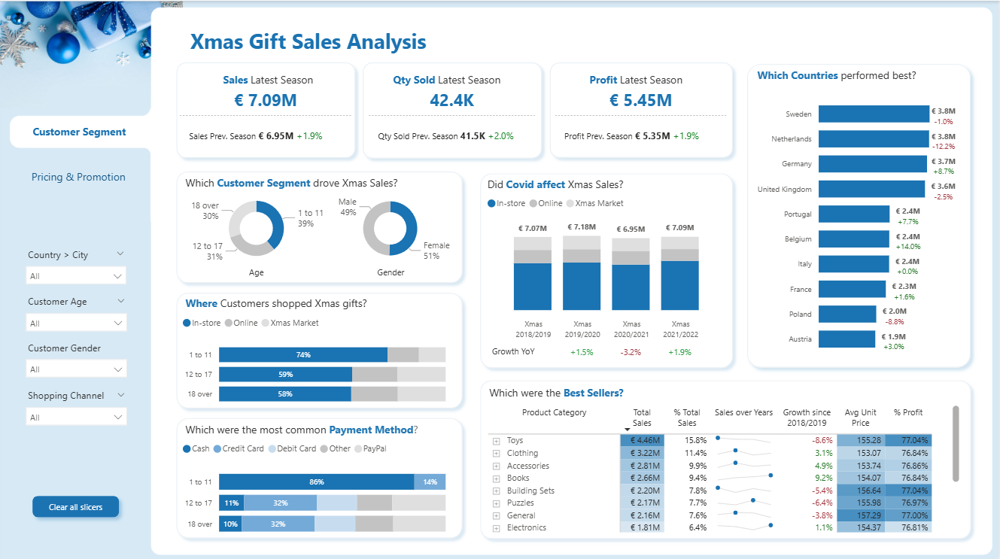
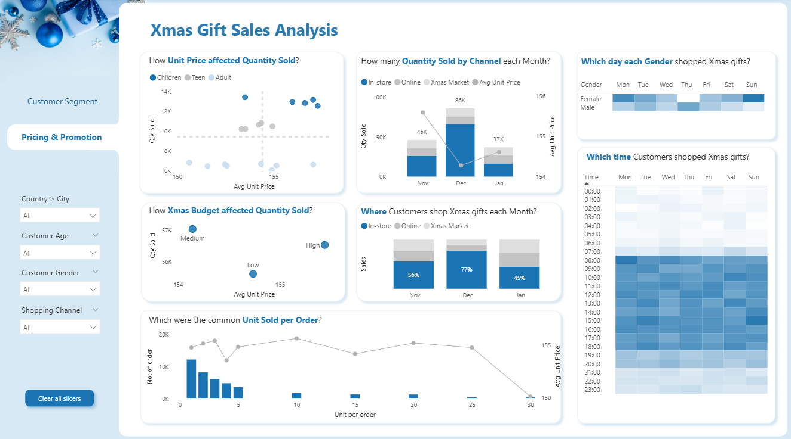

# 🎄 Xmas Gift Sales Analysis Dashboard

Welcome to the **Xmas Gift Sales Analysis** project! This repository contains a comprehensive data analytics dashboard designed to uncover actionable insights into Christmas shopping behaviors, sales performance, and customer segmentation.

---

## 📸 Dashboard Previews

### 1. Customer Segment Analysis
This view focuses on understanding *who* our customers are, *where* they are from, and *how* they prefer to pay.

### 2. Pricing & Promotion Insights
This view dives into the relationship between pricing, budgets, and purchasing habits across different days and times.

*(Note: Please ensure the images you uploaded are saved as `customer_segment.png` and `pricing_promotion.png` in this repository for the previews to work properly!)*

---

## 📊 Key Insights & Metrics

### 🎯 High-Level Performance (Latest Season)
- **Total Sales:** € 7.09M *(+1.9% YoY)*
- **Total Quantity Sold:** 42.4K *(+2.0% YoY)*
- **Total Profit:** € 5.45M *(+1.9% YoY)*

### 🧑‍🤝‍🧑 Customer Demographics
- **Gender:** Females represent the majority of shoppers (51%) compared to Males (49%).
- **Age Groups:** The largest shopper segment is parents/guardians buying for the **1 to 11 age group (39%)**, followed by **12 to 17 (31%)** and **18 over (30%)**.
- **Top Performing Countries:** Sweden (€3.8M), Netherlands (€3.8M), and Germany (€3.7M) lead the sales charts.

### 🛍️ Shopping Behavior & Trends
- **Covid Impact:** Sales remained relatively resilient, with a slight dip in 2020/2021 (-3.2%) but bouncing back in 2021/2022 (+1.9%).
- **Peak Shopping Times:** Heatmaps indicate specific peak hours and days when different genders prefer to shop.
- **Preferred Channels:** **In-store** remains the dominant channel across all age groups, but **Online** and **Xmas Markets** show significant activity, particularly in December.
- **Payment Methods:** **Cash** is overwhelmingly the most common payment method for the youngest demographic, while credit/debit card usage increases with age.

### 📦 Product Performance
- **Top Categories:** **Toys** (€4.46M, 15.8% of Total Sales) and **Clothing** (€3.22M, 11.4%) are the definitive best-sellers.
- **Profitability:** Most top categories maintain a healthy profit margin of ~76-77%.

---

## 🛠️ Project Structure
This project includes PowerBI semantic models and report configurations:
- `/DataModel`: Contains the core data relationships and measures.
- `/Report`: Layout and visual configurations for the dashboards.
- `/Connections`: Data source connection settings.

---

## 💡 How to Use
1. Clone the repository to your local machine.
2. Open the project using **Power BI Desktop** (or extract the components if treating as a PowerBI Project `.pbip`).
3. Refresh the data sources if connected to an external database.
4. Interact with the slicers on the left-hand pane (Country, City, Customer Age, Gender, Shopping Channel) to filter the insights dynamically!

---
*Created with ❤️ for Data Analytics & Christmas Spirit!*
